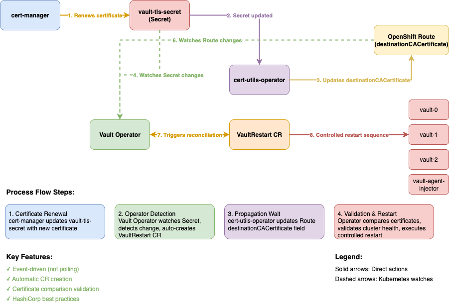

# vault-restart Operator

The **vault-restart-operator** is a Kubernetes controller designed to
safely orchestrate rolling restarts of HashiCorp Vault clusters using
the Raft storage backend. It ensures high availability by coordinating
restarts so that the active Vault node is always restarted last,
minimizing downtime and maintaining cluster health throughout the process.

## Description

Currently, the operator monitors Kubernetes Secrets that are labeled with `vault.operator/watch: true`. When a Secret with this label is updated—such as when a TLS certificate is rotated—the operator automatically triggers a rolling restart of the associated Vault cluster. This ensures that Vault nodes pick up the new certificate without manual intervention, maintaining security and minimizing downtime.

## Example Workflow

When a certificate in a Secret is updated, the operator performs the following steps:

1. cert-manager updates the `vault-tls-secret`.
2. The operator detects the change in the Secret.
3. The operator calculates a hash of the Secret's content.
4. The operator automatically creates a VaultRestart custom resource (CR) for the restart process.
5. During the first reconciliation, the operator populates the `status.secretHash` field in the CR.
6. The operator uses the hash to track further changes to the Secret and trigger additional restarts if needed.

## Getting Started



## VaultRestart CR

```yaml
apiVersion: vault.redhat.com/v1/vaultrestarts
kind: VaultRestart
metadata:
  name: auto-restart-vault-tls-secret-1642012345
spec:
  statefulSetName: "vault"       # From Secret's vault.operator/statefulset label
  secretName: "vault-tls-secret" # From the changed Secret
  reason: "cert-rotation"        # Automatically set for cert changes
status:
  phase: "Pending"
  secretHash: "a1b2c3d4..."      # Calculated by operator
  lastUpdated: "2025-01-18T10:30:45Z"
```

### Prerequisites

- go version v1.24.0+
- docker version 17.03+.
- kubectl version v1.11.3+.
- Access to a Kubernetes v1.11.3+ cluster.

## Building the Operator

```bash
make docker-build docker-push IMG=""
```

## Local Development

## Development

## Roadmap

- Provide ability to restart cluster during upgrades of Vault
- Evaluate the k8s auth method and its various configurations
